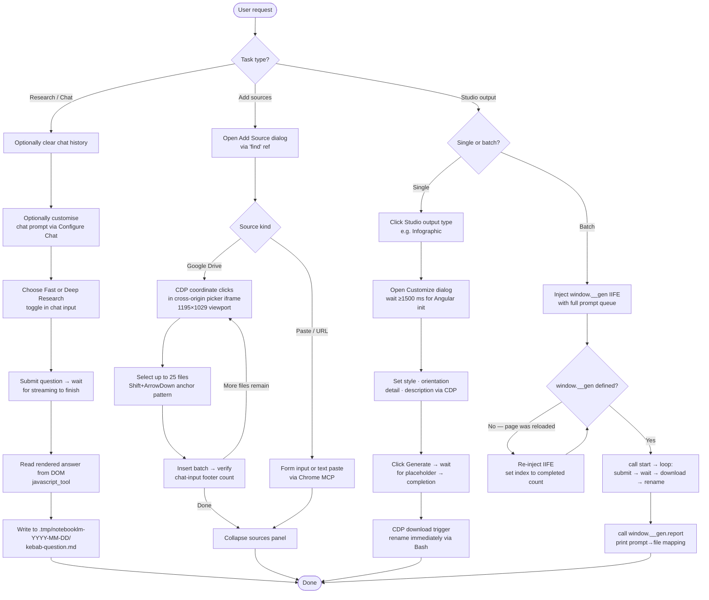

# notebooklm
End-to-end automation of Google NotebookLM via the Chrome MCP and targeted JavaScript injections. The skill covers the full source lifecycle (paste, URL, Google Drive, shared folders), research workflows (Fast Research, Deep Research), chat customisation, durable capture of chat answers to local Markdown files, and the complete Studio output surface (Infographic, Mind Map, Audio Overview, Slide Deck, plus batch automation).

It encodes the operational quirks that make NotebookLM hard to drive from an agent — phantom source rows, quota cooldown, cross-origin Drive picker, Angular initialisation timing, silent daily-limit failures — so a fresh agent can act correctly on the first try.

## Install

The fastest cross-agent install path is the `skills` CLI:

```bash
npx skills add gg-skills/notebooklm
```

Drop this skill into a workspace as a Git submodule for pinned versions, or as a plain clone for latest `main`:

```bash
# Project-local, version-pinned:
git submodule add git@github.com:gg-skills/notebooklm.git .claude/skills/notebooklm

# OR project-local, latest main:
mkdir -p .claude/skills
git -C .claude/skills clone git@github.com:gg-skills/notebooklm.git

# OR user-level, available in every project on this machine:
mkdir -p ~/.claude/skills
git -C ~/.claude/skills clone git@github.com:gg-skills/notebooklm.git
```

Restart your agent or reload skills after installation. See the parent [`skills` catalog repo](https://github.com/gg-skills/skills) for the full catalog.

## When to use

- Adding sources to a notebook (pasted text, URL, Google Drive files)
- Importing an entire Google Drive folder in batches
- Running Fast Research or Deep Research inside NotebookLM
- Customising the notebook's chat answer style or system prompt
- Extracting and persisting a chat answer to a local file
- De-duplicating paired Google Doc / PDF sources to reclaim source slots
- Bulk-deleting all sources from a notebook
- Navigating the Drive picker when standard `find` refs fail (cross-origin iframe)
- Switching Chrome profiles before a NotebookLM session
- Generating Studio outputs: Infographic, Mind Map, Audio Overview, Slide Deck, Video Overview, Reports, Flashcards, Quiz, Data Table
- Customising a Studio output (style, orientation, detail level, description prompt)
- Batch-generating dozens of infographics via the `window.__gen` automation helper
- Opening a completed Studio artifact for viewing, downloading, or sharing

Skip when the task is general Chrome automation unrelated to NotebookLM.

## How it operates

### Inputs

**Sources to add to a notebook** — four kinds:

| Kind | Example | Notes |
|------|---------|-------|
| Pasted text | A blob of plain text copied from anywhere | Opens "Add source" → "Paste text"; no URL required |
| Website URL | `https://example.com/article` | Must include `https://`; bare domains fail |
| Google Drive file | A Doc or PDF selected via the Drive picker | Cross-origin iframe — requires CDP coordinate clicks, not `find` |
| Shared folder batch | Drive folder imported 25 files at a time with `Shift+ArrowDown` anchor extension | Hard 25-item picker cap per batch; track the last-imported filename as anchor |

**Chat queries** — natural-language questions typed into the notebook chat. The skill can also customise the notebook's system prompt via Configure Chat before sending.

**Studio output choices** — the user specifies which Studio artifact to generate and any customisation parameters (style, orientation, detail level, description prompt).

### Outputs

**Chat captures** — the skill reads the rendered chat answer from the DOM after streaming completes and writes it to a local Markdown file under `.tmp/notebooklm-YYYY-MM-DD/` using a kebab-cased filename derived from the question (e.g. `who-works-at-ai-profile.md`). One folder per calendar day, shared across all answers in that session.

**Studio artifacts** generated inside NotebookLM:

| Output type | Format | Download |
|-------------|--------|----------|
| Infographic | PNG image | CDP download trigger; renamed immediately to `q{i:02d}-{kebab-title}.png` via `window.__gen.slug(i)` |
| Mind Map | Interactive web view | Viewed in-browser; no file download |
| Audio Overview | MP3 podcast-style audio | Downloadable from the Studio panel |
| Slide Deck | Google Slides document | Opens in Google Slides; shareable link |

After any batch download, `window.__gen.report()` is called and the full prompt → file mapping is printed and preserved.

### External commands

All automation runs through two tool families — no native OS clicks on Chrome:

- **`mcp__Claude_in_Chrome__*`** (Chrome MCP) — the primary interface. Used for `find` (DOM ref resolution), `read_page`, `get_page_text`, `javascript_tool` (JS injection), `navigate`, and `form_input`.
- **`mcp__Claude_in_Chrome__browser_batch`** with `{name: "computer", input: {action: "left_click", coordinate: [x, y], tabId: N}}` — CDP coordinate clicks used wherever `find` cannot reach (Drive picker cross-origin iframe, viewer controls). Chrome is granted at the `read` tier, so OS-level `computer_batch` clicks are blocked; `browser_batch` with the `computer` name bypasses that restriction via the Chrome DevTools Protocol.

JavaScript snippets are injected via `javascript_tool` for counter reads, dialog scoping, Angular-safe click sequences (`mousedown` + `mouseup` + `click`), and the `window.__gen` batch automation IIFE.

### Side effects

- **Google Drive picker interactions** — the picker opens as a cross-origin iframe at a fixed `1195×1029` viewport. The skill navigates it via CDP coordinate clicks, uses `End` key virtual-scroll to reach the bottom of large folders, and clears stale selections by clicking the X button at approximately `(107, 790)`.
- **File downloads to local disk** — infographic PNGs are downloaded via CDP download trigger and immediately renamed with `mv` via Bash. The download directory is whatever Chrome's default download folder is configured to.
- **Session folder creation** — `.tmp/notebooklm-YYYY-MM-DD/` is created on first answer capture if it does not already exist.
- **Chat history clearing** — the skill clears NotebookLM chat history before each new unrelated question to prevent prior responses from contaminating context.

### Mode toggles

- **Fast Research vs Deep Research** — Fast Research returns a quick synthesised answer; Deep Research runs a multi-step reasoning pass and takes longer. Selected via the research mode toggle in the chat input area. See `references/research-and-chat.md` for the exact `find` selectors.
- **Chat customisation** — Configure Chat opens a system-prompt editor. The skill can set a custom answer style (e.g. concise bullets, executive tone) or clear an existing prompt. Customisation applies to all subsequent answers in the session.
- **Infographic customisation** — the Customize Infographic dialog exposes visual style (11 radio options), orientation (portrait/landscape), detail level, and a free-text description prompt. Angular needs ≥1500 ms after dialog open before radio buttons accept clicks; the skill waits accordingly.
- **Batch automation (`window.__gen`)** — an in-memory IIFE injected via `javascript_tool` that loops through a prompt queue, submits each infographic generation, waits for completion, triggers download, and tracks done/failed state. The object is wiped on page reload; the skill always checks `typeof window.__gen === 'undefined'` and re-injects with the correct `index` offset before resuming.

## Operational flow



## Layout

```
.
├── SKILL.md          ← entry point with YAML frontmatter, policy, workflow map, troubleshooting
├── agents/
│   └── openai.yaml   ← agent interface descriptor
├── assets/           ← screenshots and supporting media referenced by the corpus
└── references/       ← topic docs the skill loads on demand
    ├── source-operations.md        ← add / import / dedup / delete sources, Drive batching
    ├── drive-picker-advanced.md    ← CDP coordinate clicks, virtual scroll, profile switching
    ← limits-and-quotas.md         ← counter semantics, effective cap, cooldown mechanics
    ├── research-and-chat.md        ← Fast / Deep Research, chat customisation, answer capture
    └── studio-outputs.md           ← Infographic, Mind Map, Audio Overview, batch automation
```

## Quick start

Read [SKILL.md](SKILL.md) — it contains the trigger list, the non-negotiable policy (chat clearing, session folder layout under `.tmp/notebooklm-YYYY-MM-DD/`, source-deletion guardrails), and the workflow map that points to the right `references/` file for each task. Load reference files only when the task matches; never read them speculatively.

There are no helper scripts in this skill — all work is performed by the agent through Chrome MCP tool calls (`mcp__Claude_in_Chrome__*`) and the JavaScript snippets embedded in SKILL.md and the references.

## Resources

- [SKILL.md](SKILL.md) — main entry point
- [agents/openai.yaml](agents/openai.yaml) — agent interface descriptor
- [references/](references/) — operational deep-dives loaded on demand
- [assets/](assets/) — screenshots and supporting media

## Caveats

- **Snapshot age.** Built against NotebookLM as observed in early 2026. UI layouts, source caps, and quota behaviour drift; verify against a live screenshot before acting on specific coordinates or counter values.
- **CDP, not OS clicks.** Chrome is granted at the `read` tier — OS-level `computer_batch` clicks are blocked. Use `browser_batch` with `{name: "computer", input: {action: "left_click", ...}}` for coordinate clicks inside Chrome.
- **Quota cooldown is real.** Deleted sources stay counted against the backend quota for minutes to hours. Treat dedup → reimport as a multi-hour workflow, not a same-session operation.
- **Drive picker is a cross-origin iframe.** Standard `find` refs cannot reach it; navigation requires CDP coordinate clicks at the documented 1195×1029 viewport.
- **Angular timing matters.** The Customize Infographic dialog needs ≥1500 ms after opening before radio buttons accept clicks. Calling earlier silently no-ops.
- **`window.__gen` is in-memory only.** A page reload wipes the batch state — always check `typeof window.__gen === 'undefined'` and re-inject the IIFE before resuming.
- **Daily Infographic limit fails silently.** When the limit is hit, Generate closes the dialog with no toast and no placeholder. Check the Studio panel for the blue banner before starting a batch.
